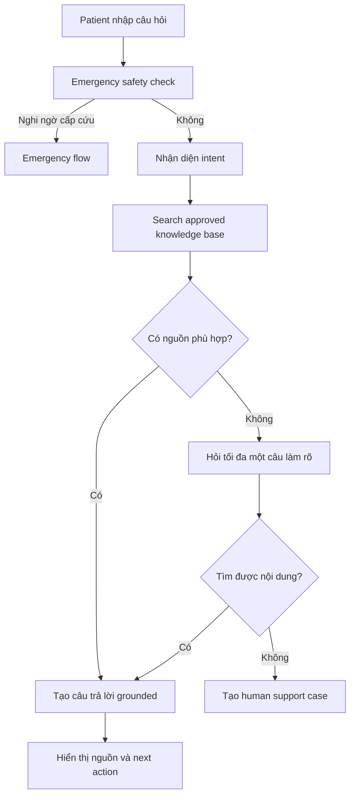
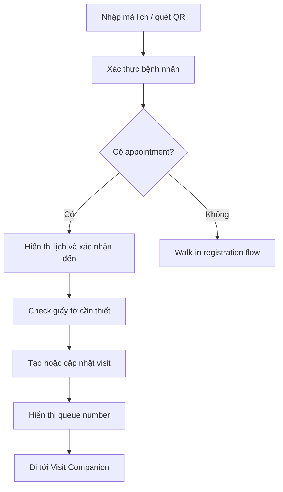
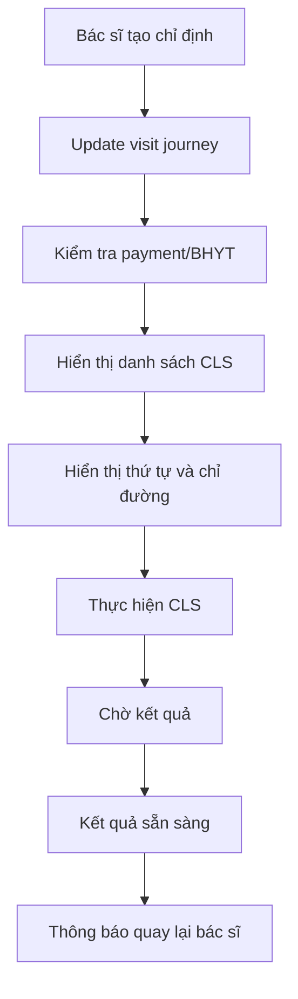
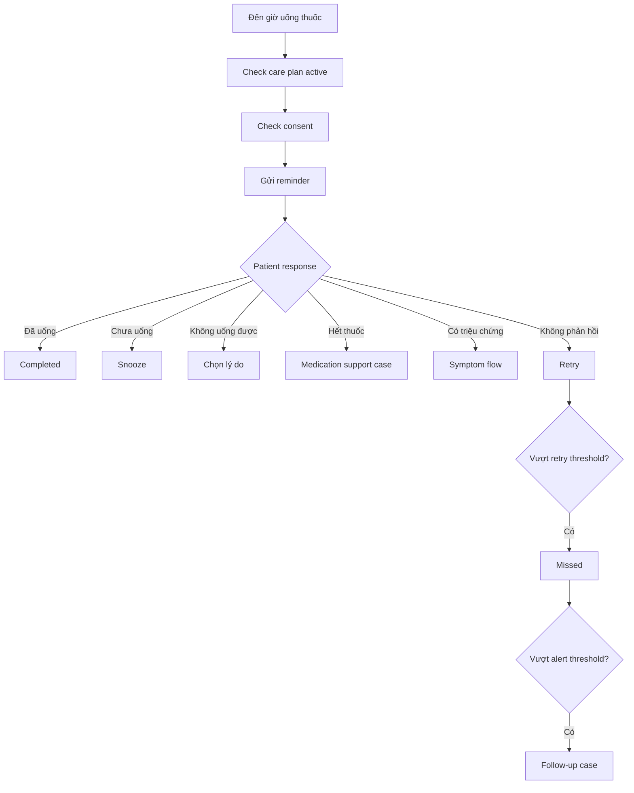
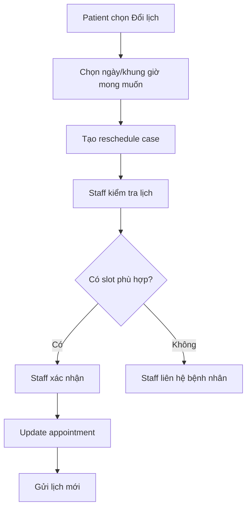
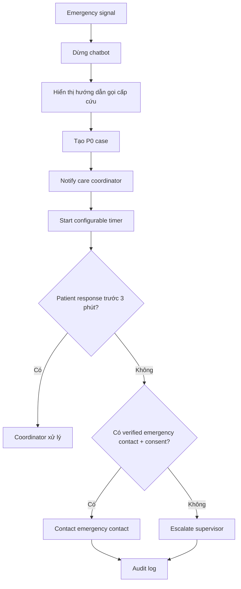
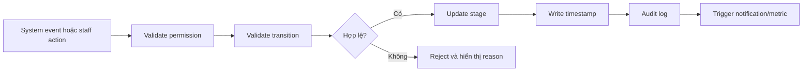
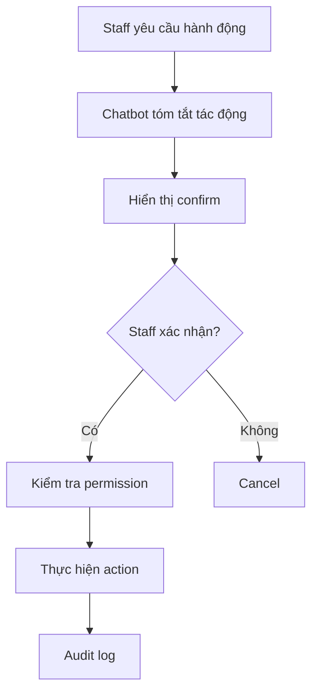

# Product & UI Requirements
## Hanoi Heart Hospital Website - Patient Journey, Staff Operations & AI Assistant

**Document type:** Product Requirement Document (PRD) + UI Requirement Specification  
**Version:** 0.1 Draft  
**Target platform:** Responsive website; có thể tái sử dụng backend cho Zalo Mini App  
**Primary language:** Vietnamese  
**Primary users:** Patient, Caregiver, Administrative Staff, Nurse, Doctor, Operations Manager  
**Source process:** Quy trình đón tiếp bệnh nhân và khám chữa bệnh ngoại trú tại Khu Tự nguyện 1 - Cơ sở 1, mã QT.25.01, ban hành ngày 05/12/2024  
**Document status:** Chờ xác nhận của Bệnh viện Tim Hà Nội về quy trình, SLA, quyền truy cập và nội dung y khoa

---

# 1. Mục tiêu sản phẩm

Xây dựng một website giúp:

1. Bệnh nhân hiểu và theo dõi hành trình khám ngoại trú.
2. Bệnh nhân nhận thông báo khi sắp đến lượt khám hoặc cần chuyển sang bước tiếp theo.
3. Bệnh nhân hỏi FAQ và quy trình bệnh viện bằng chatbot có nguồn.
4. Nhân viên theo dõi bệnh nhân theo Kanban journey.
5. Nhân viên hỏi procedure, metrics vận hành và trạng thái bệnh nhân qua chatbot nội bộ.
6. Các trường hợp AI không xử lý được được chuyển vào Human-in-the-loop Dashboard.
7. Bệnh nhân nhận nhắc thuốc, nhắc tái khám và có thể báo tình trạng bất thường.
8. Các trường hợp nghi ngờ cấp cứu được flag và chuyển cho người chịu trách nhiệm theo workflow được phê duyệt.

---

# 2. Căn cứ nghiệp vụ

Quy trình ngoại trú hiện tại bao gồm các bước chính:

```text
Đặt lịch trước hoặc đến trực tiếp
→ Lấy số tiếp nhận
→ Đăng ký khám và kiểm tra giấy tờ
→ Kiểm tra BHYT và thu phí
→ Đo dấu hiệu sinh tồn
→ Chờ khám
→ Bác sĩ khám
→ Thực hiện cận lâm sàng nếu có
→ Nhận kết quả và quay lại bác sĩ
→ Kê đơn / hẹn tái khám / chỉ định nhập viện
→ Thanh toán cuối
→ Lĩnh hoặc mua thuốc
→ Kết thúc lượt khám
```

**Ghi chú:** Đây là workflow được số hóa từ QT.25.01, đặc biệt các bước tại trang 4-8. Những tính năng như reminder thuốc, emergency escalation 3 phút, AI chatbot và Kanban là phần mở rộng sản phẩm, chưa mặc nhiên là quy trình chính thức của bệnh viện.

---

# 3. Phạm vi

## 3.1. In scope

- Patient website và patient portal.
- Patient FAQ chatbot.
- Visit companion cho bệnh nhân đang đến khám.
- Live queue notification.
- Patient profile.
- Medication reminder.
- Follow-up appointment reminder.
- Symptom reporting.
- Emergency flag workflow.
- Staff operations portal.
- Patient journey Kanban.
- Staff procedure chatbot.
- Staff operational metrics chatbot.
- Human-in-the-loop dashboard.
- Procedure knowledge management.
- Role-based access control.
- Consent và audit log.

## 3.2. Out of scope cho MVP

- AI tự chẩn đoán.
- AI tự thay đổi thuốc hoặc liều.
- AI tự phê duyệt nhập viện.
- AI tự đổi lịch khám mà không có staff xác nhận.
- AI tự kết luận quyền lợi BHYT.
- AI tự sửa bệnh án hoặc doctor notes.
- AI tự gọi xe cấp cứu.
- Tích hợp thiết bị y tế tại nhà.
- Dự báo lâm sàng bằng mô hình machine learning.
- Thay thế HIS, LIS, PACS hoặc payment system.

---

# 4. Phân kỳ yêu cầu

Các requirement được gắn tag:

- **[MVP]**: bắt buộc cho phiên bản đầu.
- **[P2]**: phase 2, sau khi tích hợp hệ thống bệnh viện.
- **[P3]**: nâng cao, cần dữ liệu và governance tốt.
- **[SAFETY]**: yêu cầu an toàn bắt buộc.
- **[SECURITY]**: yêu cầu bảo mật bắt buộc.

---

# 5. Người dùng và vai trò

## 5.1. Patient

Có thể:

- Hỏi FAQ.
- Xem quy trình khám.
- Đặt hoặc xem lịch khám.
- Check-in.
- Xem số thứ tự và trạng thái lượt khám.
- Nhận hướng dẫn đi đến phòng khám hoặc khu cận lâm sàng.
- Xem hồ sơ cá nhân trong phạm vi cho phép.
- Nhận nhắc thuốc và nhắc tái khám.
- Báo đã uống, chưa uống, không uống được, hết thuốc, có triệu chứng hoặc không phản hồi.
- Yêu cầu human support.
- Quản lý emergency contact và consent.

## 5.2. Caregiver

Có thể, khi có consent:

- Nhận notification được bệnh nhân cho phép.
- Hỗ trợ xác nhận nhắc thuốc.
- Nhận emergency escalation.
- Hỗ trợ bệnh nhân quản lý lịch tái khám.

## 5.3. Administrative Staff

Có thể:

- Theo dõi Kanban journey.
- Xem thông tin hành chính, appointment, BHYT và payment status theo quyền.
- Xử lý callback, reschedule và document issues.
- Hỏi procedure chatbot.
- Hỏi operational metrics chatbot.
- Xử lý human-in-the-loop cases.
- Không mặc định được xem toàn bộ dữ liệu lâm sàng.

## 5.4. Nurse

Có thể:

- Xem vital signs và care plan.
- Xem symptom alerts.
- Xử lý follow-up ticket.
- Ghi nhận kết quả liên hệ.
- Escalate sang bác sĩ.

## 5.5. Doctor

Có thể:

- Xem medical history.
- Xem medication, diagnostic records và doctor notes.
- Phê duyệt care plan.
- Xác nhận medication schedule.
- Xử lý clinical alert.
- Không cho phép AI tự thay đổi ghi chú của bác sĩ.

## 5.6. Operations Manager

Có thể:

- Xem metrics tổng hợp.
- Xem bottleneck.
- Xem SLA và workload.
- Phân công hoặc điều phối nguồn lực.
- Không mặc định xem chi tiết nhạy cảm của bệnh nhân.

## 5.7. System Administrator

Có thể:

- Quản lý user, role, permission và cấu hình.
- Quản lý integration health.
- Không mặc định xem nội dung lâm sàng.

## 5.8. Auditor

Có thể:

- Xem audit log.
- Không được chỉnh sửa dữ liệu.

---

# 6. Information Architecture

## 6.1. Patient website

```text
/
├── /assistant
├── /procedures
├── /appointments
├── /check-in
├── /visit/{visit_id}
├── /patient/profile
├── /patient/appointments
├── /patient/medications
├── /patient/follow-ups
├── /patient/documents
├── /patient/notifications
├── /patient/emergency-contact
└── /patient/consents
```

## 6.2. Staff portal

```text
/staff
├── /staff/operations
├── /staff/operations/kanban
├── /staff/human-in-loop
├── /staff/human-in-loop/{case_id}
├── /staff/patients
├── /staff/patients/{patient_id}
├── /staff/visits/{visit_id}
├── /staff/procedures
├── /staff/procedures/{procedure_id}
├── /staff/analytics
├── /staff/notifications
├── /staff/audit
└── /staff/settings
```

---

# 7. Khung giao diện chung

## 7.1. Patient website shell

```text
Header
├── Logo Bệnh viện Tim Hà Nội
├── Khám bệnh
├── Quy trình
├── Tra cứu lịch
├── Hỗ trợ
├── Đăng nhập
└── Emergency CTA

Main content

Floating AI Assistant button

Footer
├── Địa chỉ
├── Hotline
├── Chính sách bảo mật
├── Điều khoản
└── Thông tin cấp cứu
```

## 7.2. Staff portal shell

```text
Top bar
├── Facility selector
├── Global search
├── Data freshness indicator
├── Notification bell
└── User profile

Left sidebar
├── Operations
├── Human-in-the-loop
├── Patients
├── Procedures
├── Analytics
├── Notifications
└── Settings

Main workspace

Right-side chatbot drawer
```

## 7.3. Responsive requirements

- **[MVP]** Patient website phải mobile-first.
- **[MVP]** Staff portal ưu tiên desktop từ 1280px trở lên.
- **[MVP]** Kanban trên màn hình nhỏ chuyển thành list view theo stage.
- **[MVP]** Chatbot drawer trên desktop nằm bên phải; trên mobile mở full screen.
- **[MVP]** Mọi CTA quan trọng phải có vùng bấm tối thiểu phù hợp người lớn tuổi.
- **[MVP]** Không dùng màu là tín hiệu duy nhất; phải có icon và label.

---

# 8. Patient Homepage

## 8.1. Mục tiêu

Giúp bệnh nhân nhanh chóng thực hiện một trong các tác vụ:

- Đặt lịch.
- Tra cứu lịch.
- Theo dõi lượt khám hôm nay.
- Hỏi chatbot.
- Xem quy trình khám.
- Liên hệ hỗ trợ.
- Gọi cấp cứu khi cần.

## 8.2. Hero section

Các CTA:

```text
[Đặt lịch khám]
[Tra cứu lịch khám]
[Theo dõi lượt khám]
[Hỏi trợ lý bệnh viện]
```

## 8.3. Quick actions

- Khám lần đầu.
- Khám lại.
- Khám BHYT.
- Chuẩn bị giấy tờ.
- Hướng dẫn cận lâm sàng.
- Lấy kết quả.
- Lĩnh thuốc.
- Liên hệ bệnh viện.

## 8.4. Emergency banner

- **[SAFETY]** Luôn có link rõ ràng tới hướng dẫn cấp cứu.
- Nội dung không được gây hiểu rằng chatbot là dịch vụ cấp cứu.
- CTA ví dụ:

```text
Bạn đang đau ngực dữ dội, khó thở hoặc mất ý thức?
[Gọi 115] [Xem hướng dẫn cấp cứu]
```

---

# 9. Patient FAQ Chatbot

## 9.1. Mục tiêu

Trả lời câu hỏi dựa trên procedure và thông tin chính thức đã được phê duyệt.

## 9.2. Các nhóm câu hỏi

- Giờ làm việc.
- Cơ sở khám.
- Giấy tờ cần mang.
- BHYT.
- Đặt lịch.
- Khám lần đầu.
- Khám lại.
- Cận lâm sàng.
- Thanh toán.
- Lĩnh thuốc.
- Hẹn tái khám.
- Hướng dẫn sau khám.
- Chỉ đường trong bệnh viện.

## 9.3. Conversation flow



## 9.4. Answer component

Mỗi câu trả lời gồm:

- Câu trả lời ngắn, dễ hiểu.
- Các bước thực hiện nếu là procedure.
- Nút hành động tiếp theo.
- Tên procedure hoặc nguồn.
- Ngày cập nhật.
- CTA human support.

Ví dụ:

```text
Để đăng ký khám BHYT, bạn cần chuẩn bị:
1. CCCD hoặc giấy tờ tùy thân hợp lệ.
2. Thẻ BHYT hoặc dữ liệu BHYT điện tử.
3. Giấy chuyển tuyến khi trường hợp của bạn yêu cầu.

Nguồn: QT.25.01 - Tiếp nhận thông tin đăng ký khám
Cập nhật: 05/12/2024

[Xem toàn bộ quy trình] [Liên hệ nhân viên]
```

## 9.5. Out-of-scope handling

- **[MVP]** Không trả lời bằng kiến thức chung nếu câu hỏi là hospital-specific.
- **[MVP]** Hiển thị rõ không tìm thấy thông tin được phê duyệt.
- **[MVP]** Cho phép tạo callback/chat case.
- **[MVP]** Gửi conversation summary cho staff.
- **[MVP]** Hiển thị mã case cho bệnh nhân.
- **[P2]** Hiển thị estimated response SLA theo loại case.

## 9.6. Chatbot UI states

- Welcome.
- Typing.
- Searching source.
- Answer with source.
- Clarification.
- Out of scope.
- Human handover created.
- Emergency interrupted.
- Network failure.
- Session expired.

---

# 10. Appointment & Check-in

## 10.1. Appointment lookup

Input:

- Số điện thoại.
- Mã lịch hẹn.
- Ngày sinh hoặc OTP xác thực.

Output:

- Ngày giờ khám.
- Cơ sở.
- Khoa.
- Bác sĩ, nếu được phép.
- Trạng thái.
- Hướng dẫn chuẩn bị.
- CTA check-in khi phù hợp.

## 10.2. Check-in flow



## 10.3. Check-in screen

Hiển thị:

- Họ tên rút gọn.
- Ngày giờ.
- Cơ sở.
- Loại khám.
- BHYT/dịch vụ.
- Các giấy tờ còn thiếu.
- Số thứ tự.
- Current stage.
- Nút “Tôi cần hỗ trợ”.

---

# 11. Visit Companion

## 11.1. Mục tiêu

Hỗ trợ bệnh nhân khi đang có mặt tại bệnh viện.

## 11.2. Visit timeline

```text
✓ Đã check-in
✓ Đã đăng ký
● Đang chờ thanh toán
○ Đo dấu hiệu sinh tồn
○ Chờ bác sĩ
○ Khám
○ Cận lâm sàng
○ Quay lại bác sĩ
○ Lĩnh thuốc
```

## 11.3. Current stage card

Hiển thị:

- Tên bước hiện tại.
- Số thứ tự.
- Phòng/khu vực.
- Số lượt trước bệnh nhân.
- Thời gian cập nhật gần nhất.
- Hướng dẫn chuẩn bị.
- CTA “Xem chỉ đường”.
- CTA “Tôi cần hỗ trợ”.

## 11.4. Queue notification

Khi sắp đến lượt:

```text
Sắp đến lượt khám của bạn.

Số thứ tự: A024
Phòng: 201
Tầng: 2
Còn khoảng 3 lượt trước bạn.

[Tôi đang đến phòng]
[Xem chỉ đường]
[Tôi cần hỗ trợ]
```

Yêu cầu:

- **[MVP]** Thông báo trong website.
- **[P2]** Zalo/SMS/push notification.
- **[MVP]** Không cam kết ETA chính xác nếu nguồn dữ liệu không hỗ trợ.
- **[MVP]** Hiển thị “Dữ liệu cập nhật lúc”.
- **[P2]** Cho phép bệnh nhân thông báo đang ở xa phòng khám.

## 11.5. Cận lâm sàng flow



Danh sách hiển thị:

- Loại chỉ định.
- Vị trí.
- Trạng thái.
- Điều kiện chuẩn bị.
- Queue number nếu có.
- Kết quả đã sẵn sàng hay chưa.

---

# 12. Patient Profile

## 12.1. Navigation tabs

```text
Tổng quan
Hành trình hiện tại
Lịch khám
Tiền sử
Thuốc
Kết quả & hình ảnh
Ghi chú
Care plan
Nhắc lịch
Liên hệ khẩn cấp
Consent
Lịch sử hoạt động
```

## 12.2. Overview

Hiển thị:

- Thông tin định danh.
- Mã bệnh nhân.
- Số điện thoại.
- Trạng thái BHYT.
- Lịch tiếp theo.
- Current visit.
- Active care plan.
- Alert đang mở.
- Emergency contact status.

## 12.3. Medical history

Dữ liệu:

- Tiền sử bệnh tim mạch.
- Bệnh nền.
- Dị ứng.
- Can thiệp/phẫu thuật trước đây.
- Lần nhập viện trước.
- Family history nếu có.
- Clinical alerts.

Quyền:

- Patient xem bản tóm tắt được bệnh viện cho phép.
- Admin không mặc định được xem.
- Doctor/Nurse xem theo role.

## 12.4. Diagnostics & imaging

Các loại:

- MRI.
- X-quang.
- CT.
- Siêu âm tim.
- Điện tâm đồ.
- Xét nghiệm.
- Báo cáo cận lâm sàng.

UI:

- Timeline theo ngày.
- Filter theo loại.
- Report preview.
- Link mở PACS cho staff.
- Download chỉ khi policy cho phép.
- Không hiển thị ảnh chất lượng chẩn đoán qua chatbot.

## 12.5. Doctor notes

- Hiển thị theo timeline.
- Có author, visit, loại note và thời gian.
- Không cho AI chỉnh sửa note cũ.
- Staff chatbot chỉ được tóm tắt khi role cho phép.
- Mọi lần xem note nhạy cảm phải có audit log.

---

# 13. Medication Reminder

## 13.1. Medication card

Hiển thị:

- Tên thuốc.
- Liều.
- Thời gian uống.
- Ngày bắt đầu/kết thúc.
- Người xác nhận kế hoạch.
- Trạng thái reminder hôm nay.
- Hướng dẫn đã được phê duyệt.

## 13.2. Response options

```text
Đã uống
Chưa uống
Không uống được
Hết thuốc
Có triệu chứng bất thường
Không phản hồi
```

## 13.3. Reminder flow



## 13.4. “Không uống được” reasons

- Quên mang thuốc.
- Hết thuốc.
- Buồn nôn hoặc khó chịu.
- Không chắc cách uống.
- Không muốn uống.
- Khác.

## 13.5. UI requirements

- **[MVP]** Một tap để xác nhận.
- **[MVP]** Nút lớn, text rõ.
- **[MVP]** Có lịch sử 7/30 ngày.
- **[MVP]** Không cho patient sửa tên/liều thuốc.
- **[MVP]** Có “Cần hỗ trợ”.
- **[P2]** Caregiver confirmation.
- **[P2]** Refill reminder.
- **[P3]** Adherence trend và risk prediction.

---

# 14. Follow-up Reminder

## 14.1. Reminder schedule

Mặc định đề xuất:

- Trước 7 ngày.
- Trước 3 ngày.
- Trước 1 ngày.
- Có thể cấu hình theo procedure.

## 14.2. Patient actions

```text
[Xác nhận đi khám]
[Đổi lịch]
[Không thể đến]
[Cần hỗ trợ]
```

## 14.3. Reschedule flow



Không được tự đổi lịch trước khi staff hoặc appointment system xác nhận.

---

# 15. Symptom Reporting & Emergency Flow

## 15.1. Symptom entry points

- Patient chatbot.
- Medication reminder.
- Daily check-in.
- “Tôi cần hỗ trợ”.
- Staff manual flag.

## 15.2. Emergency principle

- **[SAFETY]** Chatbot không chẩn đoán.
- **[SAFETY]** Khi có signal nghi ngờ cấp cứu, dừng flow thông thường.
- **[SAFETY]** Hiển thị gọi 115 hoặc cơ sở y tế gần nhất ngay tại T+0.
- **[SAFETY]** Không yêu cầu bệnh nhân chờ chatbot hoặc staff phản hồi.
- **[SAFETY]** Thời gian 3 phút là mốc escalation đề xuất và phải được bệnh viện phê duyệt.

## 15.3. Emergency flow



## 15.4. Emergency screen

Hiển thị:

```text
Các triệu chứng bạn mô tả có thể cần được hỗ trợ y tế ngay.

Vui lòng gọi 115 hoặc đến cơ sở y tế gần nhất.
Không nên chờ phản hồi từ chatbot.

[Gọi 115]
[Gọi bệnh viện]
[Thông báo người thân]
```

## 15.5. Emergency contact requirements

- Họ tên.
- Quan hệ.
- Số điện thoại.
- Trạng thái verified.
- Consent scope.
- Consent version.
- Ngày consent.
- Cho phép thu hồi.

---

# 16. Administrative Staff Operations Workspace

## 16.1. Layout

```text
┌────────────────────────────────────────────────────────────────────┐
│ Facility | Date | Department | Doctor | BHYT | Priority | Refresh │
├──────────────────────────────────────┬─────────────────────────────┤
│                                      │ Staff Chatbot               │
│ Patient Journey Kanban               │                             │
│                                      │ Procedure / Metrics /       │
│                                      │ Patient Operations          │
├──────────────────────────────────────┴─────────────────────────────┤
│ Alert bar: P0 | SLA overdue | Bottleneck | Notification failure   │
└────────────────────────────────────────────────────────────────────┘
```

## 16.2. Kanban columns

```text
01 Appointment Booked
02 Arrived / Waiting for Check-in
03 Registration in Progress
04 Insurance Verification
05 Payment Pending
06 Vital Signs
07 Waiting for Doctor
08 In Consultation
09 Clinical Test Ordered
10 Waiting for Clinical Test
11 Clinical Test in Progress
12 Waiting for Results
13 Return to Doctor
14 Prescription / Follow-up
15 Final Payment
16 Pharmacy
17 Completed
```

Exception lanes:

```text
Emergency
Missing Documents
Insurance Issue
Payment Issue
No-show
Need Human Support
Waiting for Caregiver
Transferred to Inpatient
Cancelled
```

## 16.3. Kanban card

Fields:

```yaml
visit_id: VISIT_001
patient_display_name: Nguyễn V. A.
queue_number: A024
current_stage: WAITING_FOR_DOCTOR
stage_entered_at: 2026-07-17T09:30:00
waiting_duration: 32 minutes
appointment_type: FOLLOW_UP
payment_type: BHYT
payment_status: PAID
priority: NORMAL
assigned_room: "201"
assigned_doctor: DOCTOR_001
next_action: CALL_PATIENT
alerts:
  - WAITING_TIME_WARNING
missing_items: []
case_count: 1
```

## 16.4. Card UI

Card header:

- Queue number.
- Patient name masked.
- Priority badge.
- Alert icon.

Card body:

- Current stage.
- Waiting duration.
- Room/doctor.
- BHYT/payment badges.
- Missing item.
- Next action.

Card footer:

- Open patient.
- Call/message.
- Assign.
- Create case.
- More actions.

## 16.5. Card interaction

- Click: mở quick view.
- Double click hoặc “Open”: mở full patient visit.
- Drag-drop: chỉ cho phép với transition hợp lệ.
- Invalid transition: chặn và hiển thị lý do.
- Override: chỉ role được phép; bắt buộc nhập reason.
- Mọi transition có audit log.

## 16.6. Kanban filters

- Cơ sở.
- Ngày.
- Khoa.
- Bác sĩ.
- Phòng.
- BHYT/dịch vụ.
- Payment status.
- Priority.
- Alert type.
- Stage.
- Waiting time.
- Human case status.
- Patient search.

## 16.7. Kanban view modes

- Kanban.
- Compact list.
- Timeline.
- Bottleneck-only.
- My assigned patients.
- SLA risk.
- Emergency.

---

# 17. Journey State Machine

## 17.1. Transition principle



## 17.2. Required fields cho mỗi transition

- from_stage.
- to_stage.
- visit_id.
- actor_id.
- actor_role.
- timestamp.
- source system.
- reason nếu manual.
- override flag.
- correlation id.

## 17.3. Stale journey detection

Nếu card không thay đổi trong thời gian cấu hình:

- Hiển thị warning.
- Đưa vào bottleneck check.
- Cho phép staff xác nhận trạng thái thực tế.
- Không tự di chuyển card nếu không có source event đáng tin cậy.

---

# 18. Bottleneck Detection

## 18.1. Bottleneck types

- Queue size vượt ngưỡng.
- Median waiting time vượt SLA.
- Processing rate thấp hơn arrival rate.
- Một phòng/bác sĩ có backlog cao.
- CLS result delay.
- BHYT verification backlog.
- Payment backlog.
- Patient card stale.
- Notification failure.
- Human cases chưa assign.

## 18.2. Bottleneck panel

Fields:

```yaml
stage: WAITING_FOR_DOCTOR
department: Outpatient Cardiology
affected_patients: 28
median_waiting_time: 42 minutes
configured_sla: HOSPITAL_DEFINED
severity: HIGH
reason: LOW_PROCESSING_RATE
detected_at: 2026-07-17T10:30:00
recommended_actions:
  - Review doctor allocation
  - Notify waiting patients
```

## 18.3. Bottleneck requirements

- **[MVP]** Rule-based thresholds.
- **[MVP]** Hiển thị nguyên nhân có thể kiểm tra.
- **[MVP]** Không tự điều phối nhân sự.
- **[MVP]** Staff acknowledge hoặc dismiss với reason.
- **[P2]** Trend theo giờ.
- **[P3]** Forecast và anomaly detection.

---

# 19. Staff Chatbot

## 19.1. Modes

Tabs trong chatbot:

```text
Procedure
Operations
Patient
```

Hệ thống phải thể hiện mode đang sử dụng để tránh nhầm lẫn.

---

## 19.2. Procedure Mode

Ví dụ:

- “Bệnh nhân BHYT chưa có CCCD thì xử lý thế nào?”
- “Sau khi có kết quả xét nghiệm, bệnh nhân quay lại đâu?”
- “Ai chịu trách nhiệm đo dấu hiệu sinh tồn?”
- “Bệnh nhân được chỉ định nhập viện cần làm gì?”

Output bắt buộc:

- Answer.
- Procedure name.
- Procedure code.
- Version.
- Effective date.
- Relevant step.
- Responsible role.
- Source section/page.
- CTA mở procedure.
- CTA tạo content issue.

Không có nguồn:

```text
Không tìm thấy nội dung đã được phê duyệt.

[Tạo yêu cầu cho quản lý quy trình]
[Chuyển cho người phụ trách]
```

---

## 19.3. Operations Mode

Ví dụ:

- “Hôm nay có bao nhiêu lượt khám?”
- “Bao nhiêu bệnh nhân đang chờ bác sĩ?”
- “Bao nhiêu bệnh nhân BHYT đã nộp phí?”
- “Có bottleneck nào cần flag?”
- “Phòng nào có thời gian chờ lâu nhất?”
- “Có bao nhiêu bệnh nhân đã làm CLS nhưng chưa quay lại bác sĩ?”
- “Bao nhiêu case sắp quá SLA?”

Output bắt buộc:

- Metric result.
- Time range.
- Facility.
- Filters.
- Data freshness.
- Data source.
- Metric definition.
- Link tới dashboard đã filter.

Ví dụ:

```text
Bệnh nhân BHYT hôm nay:

- Đã xác minh BHYT: 126
- Đã thanh toán phần đồng chi trả: 98
- Đang chờ thanh toán: 17
- Có vấn đề hồ sơ: 11

Cơ sở: Cơ sở 1
Khoảng thời gian: 00:00-10:30
Dữ liệu cập nhật: 10:31
Nguồn: HIS + Payment System

[Xem danh sách liên quan]
```

**Không được trộn các metric:**

- Verified BHYT.
- Fee generated.
- Patient co-payment paid.
- Insurance claim submitted.
- Visit completed.

---

## 19.4. Patient Mode

Ví dụ:

- “A024 hiện đang ở bước nào?”
- “Bệnh nhân còn thiếu gì?”
- “Kết quả X-quang đã có chưa?”
- “Bệnh nhân có uống thuốc sáng nay không?”
- “Lịch tái khám tiếp theo là ngày nào?”

Yêu cầu:

- **[SECURITY]** Phải chọn bệnh nhân hoặc visit context.
- **[SECURITY]** Áp dụng role permission.
- Hiển thị minimal necessary data.
- Có timestamp.
- Có link mở patient profile.
- Không cho chatbot tự chỉnh sửa dữ liệu.

---

## 19.5. Staff Chatbot write actions

Các write action cho phép khi có confirm:

- Tạo callback case.
- Assign case.
- Mark bottleneck acknowledged.
- Mở reschedule request.
- Gửi approved message template.

Flow:



Không cho phép:

- Sửa bệnh án.
- Sửa doctor notes.
- Đổi liều thuốc.
- Xác nhận thanh toán.
- Phê duyệt BHYT.
- Chuyển nhập viện.
- Đóng emergency case không có reason.

---

# 20. Human-in-the-loop Dashboard

## 20.1. Queue categories

```text
P0 Emergency
P1 Clinical Symptom Alert
P1 Missed Critical Medication
P2 Out-of-scope FAQ
P2 Callback Request
P2 Appointment Reschedule
P2 BHYT / Payment Issue
P2 Journey Bottleneck
P3 Notification Failure
P3 Missing Profile Data
P3 Procedure Content Review
```

## 20.2. Dashboard header

Metrics:

- Open cases.
- Unassigned.
- P0 unacknowledged.
- SLA due soon.
- SLA overdue.
- Average acknowledgment time.
- Average resolution time.
- Cases resolved today.

Filters:

- Priority.
- Case type.
- Facility.
- Department.
- Owner.
- Status.
- SLA.
- Created date.
- Patient.
- Source channel.

## 20.3. Case table

Columns:

- Priority.
- Case ID.
- Patient.
- Case type.
- Trigger reason.
- Created.
- SLA due.
- Owner.
- Status.
- Last action.
- CTA.

## 20.4. Case detail layout

```text
┌──────────────────────────────┬──────────────────────────────┐
│ Patient Summary              │ Conversation / Trigger       │
│ Current Journey              │ Message history              │
│ Appointment                  │ AI classification            │
│ Medication                   │ Trigger reason               │
│ Emergency Contact            │ Timeline                     │
├──────────────────────────────┼──────────────────────────────┤
│ Relevant Procedure           │ Staff Actions                │
│ Procedure code/version       │ Call                         │
│ Relevant steps               │ Message                      │
│ Approved response template   │ Contact caregiver            │
│                              │ Escalate / Resolve            │
└──────────────────────────────┴──────────────────────────────┘
```

## 20.5. Case lifecycle

```text
Open
→ Assigned
→ In Progress
→ Waiting for Patient
→ Escalated
→ Resolved
→ Closed
```

## 20.6. Case requirements

- Có owner.
- Có priority.
- Có SLA.
- Có status.
- Có reason.
- Có conversation context.
- Có patient/visit context.
- Có procedure context.
- Có action history.
- Không cho xóa audit history.
- Close bắt buộc resolution code.
- P0 close bắt buộc supervisor review.

---

# 21. Patient Detail - Staff View

## 21.1. Header

- Patient name.
- Patient ID.
- Current visit.
- Queue number.
- Current stage.
- Priority.
- Active alert.
- Emergency contact status.
- Quick actions.

## 21.2. Tabs

```text
Summary
Current Journey
Appointments
Administrative
Medical History
Medications
Diagnostics
Doctor Notes
Care Plan
Reminders
Human Cases
Communications
Consent
Audit
```

## 21.3. Role-specific view

### Receptionist

- Identity.
- Appointment.
- Queue.
- BHYT status.
- Missing documents.
- Current stage.

### Cashier

- Fee items.
- Payment status.
- Co-payment.
- Transaction issue.

### Care coordinator

- Contact details.
- Emergency contact.
- Consent.
- Medication reminder status.
- Follow-up.
- Human cases.

### Nurse

- Vital signs.
- Symptom alerts.
- Care plan.
- Medication adherence.

### Doctor

- Full clinical history as permitted.
- Diagnostics.
- Imaging.
- Doctor notes.
- Medication.
- Clinical alerts.

---

# 22. Procedure Knowledge Management

## 22.1. Procedure object

Fields:

```yaml
procedure_id: PROC_001
procedure_code: QT.25.01
title: Quy trình đón tiếp bệnh nhân và khám chữa bệnh ngoại trú
department: Khoa Khám bệnh Tự nguyện
facility: CS1
owner: USER_001
version: "07"
effective_date: 2024-12-05
review_date: 2025-12-05
status: APPROVED
audience:
  - PATIENT
  - STAFF
source_file: file_reference
```

## 22.2. Status

```text
Draft
Under Review
Approved
Published
Expired
Archived
```

## 22.3. Requirements

- Chỉ Approved + Published được dùng cho chatbot.
- Draft/Expired bị loại khỏi patient answers.
- Mọi procedure có owner.
- Có version history.
- Có effective/review date.
- Có change summary.
- Có approval history.
- Có content issue queue.
- Có preview câu trả lời chatbot.
- Có test questions cho mỗi procedure.

---

# 23. Operations Dashboard

## 23.1. Today Overview

- Tổng lịch hẹn.
- Bệnh nhân đã đến.
- Walk-in.
- No-show.
- Đang đăng ký.
- Chờ BHYT.
- Chờ thanh toán.
- Chờ bác sĩ.
- Làm CLS.
- Chờ kết quả.
- Hoàn thành.
- Chuyển nội trú.

## 23.2. Patient Flow

- Patients by stage.
- Median wait time by stage.
- P90 wait time.
- Patients over SLA.
- Longest waiting patients.
- Throughput by hour.
- Completion rate.
- Stale cards.

## 23.3. BHYT & Payment

- BHYT verified.
- Missing documents.
- Eligibility issue.
- Co-payment due.
- Co-payment paid.
- Payment failed.
- Pending cashier review.

## 23.4. Human Intervention

- Open cases.
- Unassigned.
- P0.
- SLA overdue.
- Callback.
- Out-of-scope FAQ.
- Medication alert.
- Reschedule.
- Notification failure.

## 23.5. Dashboard behavior

- Mọi widget có last updated.
- Click widget mở filtered list.
- Có facility/time filter.
- Có export nếu role cho phép.
- Stale data hiển thị warning.
- Không dùng màu duy nhất để thể hiện severity.
- Metrics có tooltip định nghĩa.

---

# 24. Metric Dictionary

## 24.1. Total Visits Today

Số visit có ngày bắt đầu nằm trong ngày hiện tại theo timezone bệnh viện.

## 24.2. Arrived Patients

Visit đã có arrival/check-in timestamp.

## 24.3. Waiting for Doctor

Visit có current_stage = WAITING_FOR_DOCTOR.

## 24.4. BHYT Verified

Visit có BHYT verification status = VERIFIED.

## 24.5. BHYT Co-payment Paid

Visit có payment item thuộc co-payment và payment status = PAID.

## 24.6. Over SLA

Thời gian ở current stage lớn hơn SLA cấu hình của stage.

## 24.7. Bottleneck

Stage thỏa ít nhất một rule:

- queue size vượt threshold;
- median waiting time vượt SLA;
- processing rate thấp hơn arrival rate;
- stale ratio vượt threshold.

## 24.8. Human-in-loop Open

Case chưa ở RESOLVED hoặc CLOSED.

## 24.9. Medication Adherence

Số reminder “Đã uống” chia cho số reminder cần phản hồi trong kỳ.

**Ghi chú:** metric này chỉ phản ánh self-report, không chứng minh bệnh nhân thực sự đã dùng thuốc.

---

# 25. Notification Service

## 25.1. Channels

- In-app/web.
- Zalo OA/Mini App.
- SMS.
- Push.
- Email.
- Voice call trong phase sau.

## 25.2. Notification types

- Appointment reminder.
- Queue soon.
- Room change.
- CLS direction.
- Result ready.
- Return to doctor.
- Medication reminder.
- Follow-up reminder.
- Human case update.
- Emergency escalation.
- Caregiver notification.

## 25.3. Delivery states

```text
Pending
Sent
Delivered
Read
Clicked
Failed
Expired
Cancelled
```

## 25.4. Requirements

- Idempotency key.
- Không gửi trùng.
- Retry có giới hạn.
- Fallback channel nếu consent cho phép.
- Delivery log.
- Template version.
- Content approval.
- Quiet hours, ngoại trừ emergency.
- Opt-out theo loại notification.

---

# 26. Consent & Privacy

## 26.1. Consent types

- Nhận notification.
- Nhận reminder thuốc.
- Nhận reminder tái khám.
- Chia sẻ với caregiver.
- Emergency contact.
- Gửi symptom data.
- Nhận Zalo/SMS.
- Cho phép staff callback.

## 26.2. Consent fields

- Consent type.
- Scope.
- Version.
- Granted at.
- Expiry, nếu có.
- Revoked at.
- Source channel.
- Verified identity.

## 26.3. Requirements

- Consent rõ ràng và dễ hiểu.
- Cho phép thu hồi.
- Thu hồi dừng notification mới.
- Giữ audit record theo policy.
- Emergency contact notification chỉ khi có consent hợp lệ.
- Không hiển thị dữ liệu nhạy cảm trong notification lock screen nếu không cần thiết.
- Minimal necessary data.

---

# 27. Role & Permission Matrix

| Function | Patient | Caregiver | Admin | Nurse | Doctor | Ops Manager | Sys Admin |
|---|---:|---:|---:|---:|---:|---:|---:|
| Xem FAQ | ✓ | ✓ | ✓ | ✓ | ✓ | ✓ | ✓ |
| Xem own appointment | ✓ | Theo consent | Theo role | ✓ | ✓ | Tổng hợp | Không mặc định |
| Xem Kanban |  |  | ✓ | ✓ | Hạn chế | ✓ | Cấu hình |
| Xem BHYT/payment | Own | Theo consent | ✓ | Hạn chế | Hạn chế | Tổng hợp | Không mặc định |
| Xem medical history | Tóm tắt | Theo consent |  | ✓ | ✓ |  |  |
| Xem doctor notes | Hạn chế |  |  | Theo policy | ✓ |  |  |
| Xử lý human case |  |  | ✓ | ✓ | ✓ | ✓ |  |
| Phê duyệt care plan |  |  |  | Theo policy | ✓ |  |  |
| Quản lý procedure |  |  | Theo role | Theo role | Theo role | Theo role | ✓ |
| Xem audit | Own activity |  | Hạn chế | Hạn chế | Hạn chế | Hạn chế | Theo role |

---

# 28. Data Model tối thiểu

## 28.1. Patient

```text
patient_id
full_name
date_of_birth
gender
phone_number
zalo_user_id
preferred_language
preferred_channel
bhyt_status
emergency_contact_id
consent_status
```

## 28.2. Visit

```text
visit_id
patient_id
appointment_id
facility_id
department_id
current_stage
stage_entered_at
queue_number
priority
assigned_room
assigned_doctor
payment_type
payment_status
bhyt_status
status
```

## 28.3. Journey Event

```text
event_id
visit_id
from_stage
to_stage
event_type
source_system
actor_id
actor_role
occurred_at
reason
override_flag
```

## 28.4. Medication Schedule

```text
schedule_id
patient_id
care_plan_id
medication_name
dosage
reminder_times
start_date
end_date
importance_level
approved_by
status
```

## 28.5. Reminder

```text
reminder_id
patient_id
schedule_id
type
scheduled_at
sent_at
delivery_status
response
response_at
```

## 28.6. Human Case

```text
case_id
patient_id
visit_id
case_type
priority
trigger_reason
source
owner_id
status
created_at
sla_due_at
resolved_at
resolution_code
```

## 28.7. Emergency Contact

```text
contact_id
patient_id
full_name
relationship
phone_number
verified
consent_scope
consent_version
consented_at
revoked_at
```

---

# 29. API Requirements

## 29.1. Patient APIs

```text
GET  /api/patient/profile
GET  /api/patient/appointments
POST /api/patient/check-in
GET  /api/patient/visits/{visit_id}
GET  /api/patient/visits/{visit_id}/journey
GET  /api/patient/medications
POST /api/patient/reminders/{reminder_id}/response
POST /api/patient/symptoms
POST /api/patient/support-cases
GET  /api/patient/notifications
PUT  /api/patient/emergency-contact
PUT  /api/patient/consents
```

## 29.2. Staff APIs

```text
GET  /api/staff/operations/kanban
GET  /api/staff/operations/metrics
GET  /api/staff/bottlenecks
GET  /api/staff/patients/{patient_id}
GET  /api/staff/visits/{visit_id}
POST /api/staff/visits/{visit_id}/transition
GET  /api/staff/cases
GET  /api/staff/cases/{case_id}
PUT  /api/staff/cases/{case_id}/assign
PUT  /api/staff/cases/{case_id}/status
POST /api/staff/cases/{case_id}/actions
GET  /api/staff/procedures
POST /api/staff/chat/query
```

## 29.3. Notification APIs

```text
POST /api/notifications/send
POST /api/notifications/provider-callback
GET  /api/notifications/{notification_id}
```

## 29.4. API response requirements

- request_id.
- timestamp.
- data freshness.
- source system.
- error code.
- user-safe error message.
- audit correlation id cho write actions.

---

# 30. UI Component Inventory

## Patient components

- Emergency banner.
- Appointment card.
- Queue card.
- Journey timeline.
- Procedure stepper.
- Chat bubble.
- Source citation card.
- Medication card.
- Reminder response buttons.
- Follow-up card.
- Consent modal.
- Caregiver card.
- Notification center.
- Document/imaging timeline.

## Staff components

- Kanban column.
- Patient journey card.
- Filter bar.
- Quick patient drawer.
- Staff chatbot drawer.
- Metric answer card.
- Procedure source card.
- Alert badge.
- Bottleneck card.
- Human case table.
- SLA timer.
- Case action panel.
- Patient summary panel.
- Audit timeline.
- Data freshness badge.

---

# 31. Loading, Empty & Error States

## 31.1. Loading

- Skeleton cho card/list.
- Spinner cho chatbot query.
- Hiển thị “Đang đồng bộ dữ liệu”.
- Không block toàn màn hình nếu chỉ một widget loading.

## 31.2. Empty states

Ví dụ:

```text
Chưa có bệnh nhân ở bước này.
Không có case cần xử lý.
Chưa có reminder hôm nay.
Không tìm thấy procedure phù hợp.
```

Mỗi empty state nên có CTA thích hợp.

## 31.3. Error states

- Integration unavailable.
- Data stale.
- Permission denied.
- Patient not found.
- Duplicate check-in.
- Invalid journey transition.
- Notification failed.
- Chatbot source unavailable.
- Session expired.

## 31.4. Data stale

Nếu dữ liệu quá thời gian cấu hình:

- Hiển thị banner warning.
- Hiển thị last successful sync.
- Tắt hoặc yêu cầu confirm cho write action phụ thuộc dữ liệu đó.
- Không để chatbot trình bày số liệu stale như real-time.

---

# 32. Accessibility

- Font chữ dễ đọc.
- Text cơ bản tối thiểu 16px trên patient UI.
- Nút lớn.
- Contrast đạt tiêu chuẩn được đội thiết kế xác nhận.
- Hỗ trợ keyboard navigation.
- Screen reader labels.
- Không chỉ dùng màu.
- TTS/STT trong phase 2.
- Nội dung tiếng Việt đơn giản.
- Hạn chế thuật ngữ y khoa không giải thích.
- Có nút nghe lại cho người lớn tuổi trong phase 2.

---

# 33. Security Requirements

- TLS cho dữ liệu truyền.
- Encryption at rest.
- Role-based access control.
- Session timeout.
- MFA cho staff nếu policy yêu cầu.
- Audit mọi truy cập dữ liệu nhạy cảm.
- Mask dữ liệu trên Kanban.
- Không gửi thông tin nhạy cảm không cần thiết qua notification.
- Rate limiting.
- Input validation.
- File upload scanning.
- Không ghi prompt hoặc response chứa dữ liệu nhạy cảm vào log không kiểm soát.
- Emergency “break glass” access phải có lý do và audit.

---

# 34. Performance & Reliability

## MVP targets đề xuất

- Page load chính dưới 3 giây trong điều kiện mạng mục tiêu.
- Staff Kanban initial load dưới 5 giây.
- Filter response dưới 2 giây với dữ liệu thường.
- Chatbot procedure response dưới 8 giây.
- Metrics chatbot response dưới 10 giây.
- Journey update hiển thị dưới 10 giây sau source event.
- Notification không gửi trùng.
- Có retry và dead-letter queue.
- Có health check cho integrations.
- Có monitoring và alert.

Các con số phải được kỹ thuật và bệnh viện xác nhận theo hạ tầng thực tế.

---

# 35. Analytics Events

## Patient events

```text
chat_question_submitted
chat_answer_viewed
chat_source_opened
human_handover_requested
appointment_viewed
check_in_completed
queue_notification_opened
journey_step_viewed
medication_reminder_received
medication_response_submitted
followup_confirmed
reschedule_requested
emergency_cta_clicked
consent_updated
```

## Staff events

```text
kanban_viewed
patient_card_opened
journey_transition_requested
journey_transition_completed
procedure_query_submitted
metrics_query_submitted
case_assigned
case_acknowledged
case_escalated
case_resolved
bottleneck_acknowledged
patient_record_viewed
```

---

# 36. Basic vs Advanced Requirements

| Module | Basic / MVP | Advanced |
|---|---|---|
| Patient FAQ | Approved procedure Q&A, source, fallback | Personalization, voice, multilingual |
| Visit Companion | Queue number, stage, room, notification | ETA prediction, indoor navigation |
| Patient Profile | Appointment, contact, medication, summary | Longitudinal unified record |
| Kanban | Stage, card, wait time, filter, audit | Predictive flow management |
| Staff Chatbot | Procedure + basic metrics + patient lookup | Root-cause analysis, recommended actions |
| Human-in-loop | Queue, owner, SLA, case lifecycle | Auto-routing, workload optimization |
| Medication | Reminder + six responses | Adherence prediction, refill forecast |
| Emergency | Rule trigger, P0, 3-minute escalation | Multi-channel automated escalation |
| Dashboard | Today, flow, BHYT, cases | Forecast, anomaly detection |
| Knowledge Base | Version, owner, approved content | Automated gap detection and testing |

---

# 37. MVP Definition of Done

## Patient

- Đăng nhập/xác thực được.
- Xem appointment.
- Check-in được.
- Xem queue number và current stage.
- Nhận notification trong website.
- Hỏi FAQ có nguồn.
- Out-of-scope tạo human case.
- Xem medication schedule.
- Phản hồi reminder.
- Quản lý emergency contact và consent.
- Emergency trigger hiển thị hướng dẫn ngay.

## Staff

- Xem Kanban theo journey.
- Filter theo facility, department, stage và alert.
- Mở patient card.
- Thực hiện transition hợp lệ.
- Xem bottleneck rule-based.
- Hỏi procedure chatbot có nguồn.
- Hỏi metrics có timestamp và source.
- Xem Human-in-loop Dashboard.
- Assign, escalate, resolve case.
- Xem patient profile theo permission.
- Mọi write action có audit log.

## Safety

- AI không tự chẩn đoán.
- AI không thay đổi thuốc.
- AI không tự đổi lịch.
- AI không tự kết luận BHYT.
- Emergency flow không yêu cầu bệnh nhân chờ.
- Contact emergency contact chỉ khi có consent.
- P0 case có acknowledgment và escalation.

---

# 38. Roadmap

## Phase 1 - UI & Operational MVP

```text
Patient FAQ chatbot
Appointment lookup
Check-in
Visit Companion
Queue notification trong website
Patient profile cơ bản
Medication reminder cơ bản
Kanban journey
Procedure chatbot
Basic metrics chatbot
Human-in-loop Dashboard
Consent, RBAC, audit
Emergency rule và P0 flow
```

## Phase 2 - Hospital Integration

```text
HIS appointment/visit integration
BHYT status integration
Payment integration
Queue calling integration
LIS integration
PACS references
Zalo/SMS notifications
Caregiver workflow
Follow-up reschedule integration
Advanced bottleneck rules
STT/TTS
```

## Phase 3 - Advanced Intelligence

```text
Waiting-time prediction
No-show prediction
Adherence risk
Journey anomaly detection
Natural-language operational analysis
Root-cause bottleneck suggestions
Remote monitoring
Personalized reminder timing
```

---

# 39. Open Questions cần bệnh viện xác nhận

1. Nguồn dữ liệu thật cho queue number và current stage là hệ thống nào?
2. HIS có API hay event stream không?
3. Payment status và BHYT status có thể đọc real-time hay batch?
4. SLA cho từng stage là bao lâu?
5. Định nghĩa chính thức của bottleneck?
6. Ai là role nhận P0 emergency alert?
7. Mốc 3 phút có được bệnh viện phê duyệt không?
8. Khi không có consent emergency contact, staff được làm gì?
9. Những dữ liệu nào patient được xem trực tiếp?
10. Admin được xem phần nào của medical history?
11. Doctor notes có được hiển thị cho patient không?
12. PACS hỗ trợ deep link hay cần viewer riêng?
13. Medication schedule được nhập từ đơn thuốc hay nhập thủ công?
14. Nhóm thuốc nào được đánh dấu critical?
15. Notification qua Zalo/SMS cần consent thế nào?
16. Ai là content owner của mỗi procedure?
17. Procedure update cần bao lâu để phản ánh lên chatbot?
18. Những write actions nào staff chatbot được phép thực hiện?
19. Website có cần song ngữ không?
20. Có yêu cầu lưu trữ dữ liệu và audit trong bao lâu?

---

# 40. Nguyên tắc thiết kế cuối cùng

```text
Mỗi bệnh nhân = một journey có trạng thái rõ ràng.

Mỗi stage = có owner, thời gian bắt đầu, next action và SLA.

Mỗi chatbot answer = có nguồn, timestamp và phạm vi.

Mỗi trường hợp AI không xử lý được = có human case và owner.

Mỗi emergency signal = hướng dẫn cấp cứu ngay, không chờ chatbot.

Mỗi write action = permission, confirmation và audit log.

Dashboard phải giúp staff hành động, không chỉ hiển thị biểu đồ.
```
